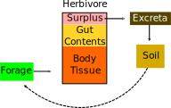

Large Herbivore Model {#page_herbiv_model}
==========================================
<!-- For doxygen, this is the *page* header -->
\brief Structure and scientific explanation of the Large Herbivore Model.

Large Herbivore Model {#sec_herbiv_model}
==========================================
<!-- For doxygen, this is the *section* header -->
\tableofcontents

<!--TODO:
- Limitations of the model design:
	+ year length of 365 assumed
	+ habitats equal size
	+ After offspring is created no connection to parents 
    -> no lactation, bonding, herding, etc.
-->

Basic Model Concepts {#sec_herbiv_basicconcepts}
------------------------------------------------

A herbivore is defined by these state variables:
- Age
- Sex
- Current energy need
- Fat mass

Plant–Herbivore Interaction {#sec_herbiv_plantherbivore_interactions}
---------------------------------------------------------------------

Each PFT can be mapped to a forage type:
@startuml "How plant functional types are mapped to forage types."
	!include herbiv_diagrams.iuml!default_pft_forage_type_mapping
@enduml

Through feeding, herbivores reduce aboveground plant biomass, i.e. carbon and nitrogen:

- The removed carbon from plant leaves is considered as a flux directly to the atmosphere (respiration).
  There is no intermediate decomposition of faeces or dead bodies in the soil.

- Nitrogen, on the other hand, moves in a closed cycle, it does not enter the atmosphere, but gets returned through excrements (and carcasses after death) directly to the plant-available soil pool.

<!-- Digestibility and C:N ratio are not coupled currently -->

### Feeding {#sec_herbiv_feeding}

### Nitrogen Excretion {#sec_herbiv_nitrogen_excretion}

Nitrogen uptake is calculated based on the C:N ratio of leaves.
The maximum amount of nitrogen (\f$N_{bound}\f$, kgN/km²) bound in herbivores is comprised of the body tissue and the contents of the digestive tract.
Any ingested nitrogen is added to the pool of herbivore-bound nitrogen, and the surplus is returned to the soil.

The amount of nitrogen bound in body tissue is approximated with 3% of live body weight (Robbins 1983\cite robbins_wildlife_1983); this ignores variation in fat and structural mass.
Upon death, this amount of nitrogen is also returned to the plant-available soil pool.

The nitrogen of ingesta in stomach and intestines depends on the mean retention time (\f$MRT\f$, hours) and the day’s intake of nitrogen (\f$I_N\f$, kgN/ind/day).
$$
N_{bound} = N_{guts} + N_{body} = I_N * MRT * P + 0.03 * M * P
$$
\f$P\f$ is the population density (ind/km²) and \f$M\f$ is the body mass (kg/ind).
Mean retention time in hours is calculated according to Clauss et al. (2007)\cite clauss_case_2007, Fig. 2:
$$
MRT = 32.8 * M^{0.07}
$$

### Trampling {#sec_herbiv_trampling}

Energetics {#sec_herbiv_energetics}
-----------------------------------

Energy Content of Forage {#sec_herbiv_energycontent}
----------------------------------------------------

\todo explain gross, digestible, metabolizable and net energy

Foraging {#sec_herbiv_foraging}
-------------------------------

\note **Units** All forage values (e.g. available grass biomass,
consumed forage) are *dry matter mass* in kilograms (`DMkg`).
Any forage per area (e.g. forage in a habitat) is `kgDM/km²`.
Herbivore-related mass values (e.g. body mass, fat mass) are also
`kg`, but live mass.
Population densities of herbivores are either in `kg/km²` or `ind/km²` (ind=individuals).

### Feeding on Plants in a Patch ### {#sec_herbiv_foraging_patch}

Each \ref Individual offers an amount of forage (kgDM/km²) that is available to herbivores (\ref Individual.get_forage_mass()).

<!-- TODO: explain some more -->

\todo Growth happens only once per year (\ref growth()) for natural vegetation.
However, seasonal shifts of forage availability are crucial for herbivore
dynamics.
A solution for that is yet to be found.

### Digestibility ### {#sec_herbiv_digestibility}
<!--
Everything: In vitro digestibility
Compare phenology digestibility with NPP-driven digestibility.

-->
Assumptions of the NPP-driven digestibility model (\ref Fauna::DigestibilityFromNPP):
- Constant proportion of NPP allocated to leaves.
- Linear decrease in forage quality.
- Turnover is constant over the year.
- Fraction of biomass older than 1 year is negligible.

Reproduction {#sec_herbiv_reproduction}
---------------------------------------

Life History {#sec_herbiv_life_history}
---------------------------------------

growth linear: \ref Fauna::HerbivoreBase::get_bodymass()

Mortality {#sec_herbiv_mortality}
---------------------------------

------------------------------------------------------------

\author Wolfgang Pappa, Senckenberg BiK-F
\date May 2017
\see \ref page_herbiv_design
\see \ref page_herbiv_tutor
\see \ref page_herbiv_tests
\see \ref group_herbivory
