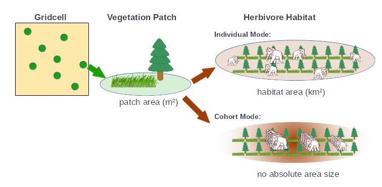

Large Herbivore Model {#page_herbiv_model}
==========================================
<!-- For doxygen, this is the *page* header -->
\brief Structure and scientific explanation of the Large Herbivore Model.

Large Herbivore Model {#sec_herbiv_model}
==========================================
<!-- For doxygen, this is the *section* header -->
\tableofcontents

<!--TODO:
- Limitations of the model design:
	+ year length of 365 assumed
	+ habitats equal size
	+ After offspring is created no connection to parents 
    -> no lactation, bonding, herding, etc.
-->

Basic Model Concepts {#sec_herbiv_basicconcepts}
------------------------------------------------

A herbivore is defined by these state variables:
- Age
- Sex
- Current energy need
- Fat mass

Plant–Herbivore Interaction {#sec_herbiv_plantherbivore_interactions}
---------------------------------------------------------------------

### Feeding {#sec_herbiv_feeding}

### Nitrogen Excretion {#sec_herbiv_nitrogen_excretion}

### Trampling {#sec_herbiv_trampling}

Energetics {#sec_herbiv_energetics}
-----------------------------------

Taylor et al 1981

Energy Content of Forage {#sec_herbiv_energycontent}
----------------------------------------------------

\todo explain gross, digestible, metabolizable and net energy

Foraging {#sec_herbiv_foraging}
-------------------------------

\note **Units** All forage values (e.g. available grass biomass,
consumed forage) are *dry matter mass* in kilograms (`DMkg`).
Any forage per area (e.g. forage in a habitat) is `kgDM/km²`.
Herbivore-related mass values (e.g. body mass, fat mass) are also
`kg`, but live mass.
Population densities of herbivores are either in `kg/km²` or `ind/km²` (ind=individuals).

### Feeding on Plants in a Patch ### {#sec_herbiv_foraging_patch}

Each \ref Individual offers an amount of forage (kgDM/km²) that is available to herbivores (\ref Individual.get_forage_mass()).

<!-- TODO: explain some more -->

\todo Growth happens only once per year (\ref growth()) for natural vegetation.
However, seasonal shifts of forage availability are crucial for herbivore
dynamics.
A solution for that is yet to be found.

### Digestibivity ### {#sec_herbiv_digestibility}

Reproduction {#sec_herbiv_reproduction}
---------------------------------------

Life History {#sec_herbiv_life_history}
---------------------------------------

growth linear: \ref Fauna::HerbivoreBase::get_bodymass()

Mortality {#sec_herbiv_mortality}
---------------------------------

------------------------------------------------------------

\author Wolfgang Pappa, Senckenberg BiK-F
\date May 2017
\see \ref page_herbiv_design
\see \ref page_herbiv_tutor
\see \ref page_herbiv_tests
\see \ref group_herbivory
